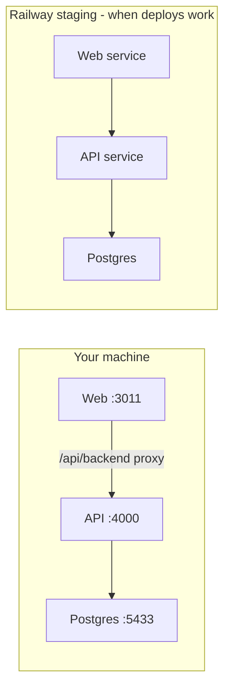

# Local development workflow

Run the full app on your machine while Railway deploys are paused or slow. **Staging (Railway)** stays the shared environment for the wider team; **local** is for fast day-to-day work.

---

## How it fits together



| Environment | Database | Web | API |
|-------------|----------|-----|-----|
| **Local** | Docker Postgres on `localhost:5433` | http://localhost:3011 | http://localhost:4000 |
| **Railway staging** | Railway Postgres | `*.up.railway.app` | separate API domain |

Local and Railway use **separate databases**. Data you create locally does not appear on staging unless you re-seed or copy data manually.

**Git:** One repo, branch `main` on GitHub. You develop locally → push `main` → Railway builds staging (when deploys are allowed).

---

## One-time setup

### Prerequisites

- Node.js **20+**
- pnpm **9** (`corepack enable && corepack prepare pnpm@9.15.0 --activate`)
- Docker Desktop (for Postgres)

### 1. Install dependencies

```bash
cd /path/to/MyGarageProApp
pnpm install
```

### 2. Start Postgres

```bash
docker compose up -d postgres
```

Postgres is mapped to host port **5433** (not 5432) so it does not clash with a system Postgres install.

### 3. Environment files

```bash
cp apps/api/.env.example apps/api/.env
cp apps/web/.env.example apps/web/.env.local
```

Defaults: `DATABASE_URL` → `localhost:5433`, `API_URL=http://localhost:4000`, `WEB_ORIGIN=http://localhost:3011`.

**Ports:** Web dev uses **3011** (macOS often reserves **7000** for AirPlay). API stays on **4000**. If you change the web port, update both `apps/web/package.json` (`dev`/`start` `--port`) and `WEB_ORIGIN` in `apps/api/.env`.

### 4. Apply migrations + seed

Use **existing** migrations from the repo (do not run `migrate dev --name init` on a fresh DB — that would try to create duplicate history):

```bash
pnpm db:migrate:deploy
pnpm db:seed
```

### 5. Run the app

```bash
pnpm dev
```

- **Web:** http://localhost:3011  
- **API health:** http://localhost:4000/health or http://localhost:3011/api/backend/health  

Check ports before starting:

```bash
lsof -nP -iTCP:3011 -sTCP:LISTEN
lsof -nP -iTCP:4000 -sTCP:LISTEN
```

### 6. Log in (after seed)

| Role | Email | Password |
|------|--------|----------|
| Super Admin | `admin@demo.garage` | `demo` |
| Owner | `owner@demo.garage` | `demo` |
| Manager | `manager@demo.garage` | `demo` |
| Mechanic | `mechanic@demo.garage` | `demo` |

---

## Daily workflow (fast iteration)

```bash
# Terminal 1 — leave running
pnpm dev
```

1. Change code in `apps/web` or `apps/api` or `packages/shared`.
2. Save — Next.js and Nest reload automatically.
3. Refresh the browser.

If you only changed **shared** types:

```bash
pnpm --filter @mygaragepro/shared build
```

Then restart `pnpm dev` if the API does not pick up types.

---

## Database / Prisma rules (avoid migration surprises)

### Golden rules

1. **Only change the schema in** `apps/api/prisma/schema.prisma`.
2. **Create migrations locally** after a schema change:

   ```bash
   pnpm --filter @mygaragepro/api exec prisma migrate dev --name short_description_of_change
   ```

3. **Commit together:** `schema.prisma` + new folder under `prisma/migrations/`.
4. **Never edit** SQL in migrations that are already on `main` / Railway.
5. **Never run** `migrate dev` against the Railway production/staging database URL.
6. After **pulling** `main`, if migrations were added:

   ```bash
   pnpm install
   pnpm db:migrate:deploy
   ```

### Local vs staging

| Command | Where | Purpose |
|---------|--------|---------|
| `pnpm db:migrate:deploy` | Local DB | Apply all committed migrations |
| `prisma migrate dev --name x` | Local DB only | Create a **new** migration from schema diff |
| `pnpm db:seed` | Local DB | Demo users + demo garage (safe to re-run upserts) |
| `migrate deploy` (API start on Railway) | Staging DB | Applies same migration files as local |

Staging and local run the **same migration files** in order — that keeps them in sync.

---

## Git workflow (push to `main` without conflicts)

Recommended for a small team:

### While Railway is paused

1. Work locally on a **feature branch** (optional but cleaner):

   ```bash
   git checkout main
   git pull origin main
   git checkout -b feat/my-feature
   ```

2. Develop + test locally (`pnpm dev`).
3. When ready:

   ```bash
   git add -A
   git commit -m "feat: describe what you built"
   git checkout main
   git pull origin main          # get teammates' changes first
   git merge feat/my-feature     # or: git rebase origin/main on your branch
   pnpm install
   pnpm db:migrate:deploy        # apply any new migrations from main
   pnpm build                    # optional sanity check
   git push origin main
   ```

4. When Railway allows deploys again → **web** and **api** deploy from `main`.

### Avoid conflicts

| Do | Don't |
|----|--------|
| `git pull origin main` before you push | Push without pulling |
| One migration per schema change, committed with schema | Two people create migrations at the same time without merging |
| Small, frequent commits to `main` | Long-lived branches with 50 files |
| Run `pnpm build` locally before push | Push broken TypeScript |

If two people add migrations at once, Git may merge both folders — resolve in Git, then run `pnpm db:migrate:deploy` locally; if Prisma complains, fix before pushing.

### What gets deployed to staging

Everything on **`main`** after a successful Railway build:

- `apps/web/**` → web service  
- `apps/api/**` + `prisma/migrations/**` → api service (migrations on start)  
- `packages/shared/**` → both need shared built in CI  

Docs-only commits may **skip** deploy (watch paths) — that is fine.

---

## Checklist before pushing to `main`

- [ ] Tested locally (`pnpm dev`, clicked through the feature)
- [ ] If schema changed: new migration committed, `pnpm db:migrate:deploy` works on a clean pull
- [ ] `pnpm build` passes (or at least `pnpm --filter @mygaragepro/web build` + api build)
- [ ] `git pull origin main` and resolve any conflicts
- [ ] No secrets in git (`.env` stays local; only `.env.example` in repo)
- [ ] Push `main` → tell team when Railway deploy is needed

---

## When staging is live again

1. Railway **web** + **api** deploy successfully from `main`.
2. API start command runs `prisma migrate deploy` (staging DB gets new migrations).
3. Team tests on staging URL; you keep using local for the next feature.

You do **not** need to “sync” local data to staging — only **code and migrations** flow through git.

---

## Troubleshooting local

| Issue | Fix |
|-------|-----|
| Port 5432 in use | Use Docker mapping **5433** (default in `docker-compose.yml` + `.env.example`) |
| Port 3011 in use | `lsof -ti:3011 \| xargs kill -9` or pick another port in web + `WEB_ORIGIN` |
| Login fails | API running? Check http://localhost:4000/health |
| API `dist/main` not found | Use `pnpm dev` (runs `nest start --watch --entryFile apps/api/src/main`) |
| Prisma migration error after pull | `pnpm db:migrate:deploy` — if failed migration, see `docs/RAILWAY_MIGRATION_FIX.md` patterns for local DB reset: `docker compose down -v` then migrate + seed again |
| Empty team table | `pnpm db:seed` |
| Web shows old UI | Hard refresh; restart `pnpm dev` |

### Reset local database (nuclear option)

```bash
docker compose down -v
docker compose up -d postgres
pnpm db:migrate:deploy
pnpm db:seed
```

---

## Quick reference

```bash
docker compose up -d postgres   # start DB (host port 5433)
pnpm dev                        # web :3011 + api :4000
pnpm db:migrate:deploy          # apply migrations
pnpm db:seed                    # demo data
pnpm build                      # pre-push check
```
