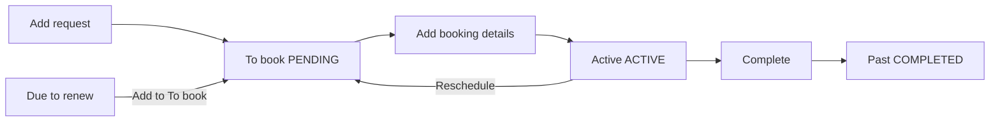

# PCO module — implementation handoff

**Purpose:** Resume PCO work without chat history. Companion to [PROGRESS.md](./PROGRESS.md) (gates) and [PROJECT_PLAN.md](./PROJECT_PLAN.md) (product vision).

**Last updated:** 2026-06-02  
**Branch:** `feat/pco-booking-workflow` (pushed: `a795f72`; **uncommitted** refinements on disk — see below)  
**Base on `main`:** `4cefc29` — initial PCO module (bookings, centres, ledger)

---

## Resume next session

1. `git checkout feat/pco-booking-workflow`
2. Read **Workflow** and **UAT test script** below
3. If API routes 404: rebuild API + run `npx prisma migrate deploy` in `apps/api`
4. Continue: commit uncommitted work → local UAT → merge PR to `main`

**Key UI:** `apps/web/src/components/pco/pco-page-content.tsx`  
**Key API:** `apps/api/src/pco/`  
**Shared types:** `packages/shared/src/pco-types.ts`

---

## Workflow (two-step booking)

| Status | UI tab | Meaning |
|--------|--------|---------|
| `PENDING` | **To book** | Request added; centre/date not set yet |
| `ACTIVE` | **Active bookings** | Centre, date, time and slot payment recorded. Mark **Client informed** / **Client confirmed** here only. |
| `COMPLETED` | **Past bookings** (paid in full) or **Outstanding** (open balance) | Job done; PCO expiry rolled forward on pass |
| `CANCELLED` | — | Removed from active lists |

**Due lists** (28-day window, not 30):

| Tab | Rule |
|-----|------|
| **Due to renew (28d)** | PCO expiry within 28 days; **excluded** if vehicle has `PENDING` or `ACTIVE` booking |
| **V5C expiring** | Logbook expiry within 28 days; same open-booking exclusion |

---

## Job types

`RENEWAL` · `NEW` · `ADMIN` · `LOGBOOK_EXPIRING` · `RETEST` · **`RESCHEDULE`** · **`CHANGE_OF_OWNERSHIP`** · **`FULL_TEST`**

- **RESCHEDULE:** On active booking → **Reschedule** moves row back to **To book** (clears centre/date; appends previous appointment to notes). On **Add request**, selecting RESCHEDULE with an active booking on the VRM prefills current booking details in notes; if active booking exists at create time, API calls `return-to-book` instead of duplicating.
- **ADMIN:** Free-text job details field.
- **CHANGE_OF_OWNERSHIP** / **FULL_TEST:** Selectable on Add request / Edit like other job types.

---

## UI features (current)

| Feature | Notes |
|---------|--------|
| **Add request** | Renamed from “Add car to list”; default charge **£140** (editable) |
| **To book table** | Priority column; sorted **HIGH → MEDIUM → LOW** |
| **Row actions** | `TableRowActionsMenu` (⋮): Add booking details, Edit, View |
| **Active row actions** | Reschedule, View |
| **Due tables** | ⋮ → Add to To book (consent + confirm details) |
| **Add booking details** | Centre, date, time, **how slot was paid**, charge (£140 default) |
| **Slot payment methods** | Bank transfer, Card, Cash, Cheque, Other, **Customer paid** |
| **Notes** | Textarea on add request, edit, renew-due modal; shown in detail view |
| **Edit** | Any booking status (all tabs) — fill in missing keeper/vehicle/TfL/notes etc.; service charge still via Amend charges after complete |
| **Vehicle fields** | Optional make, model, colour, fuel type, seats; **PCO expiry optional** (blank for brand-new vehicles); **PCO account phone** (TfL/centre account); **TfL login** email + encrypted password; **preferred centre(s)** multi-select (or Any) on Add request |
| **Booking reference** | Optional on Add booking details (TfL / centre confirmation) |
| **Amend payment** | View → Payments → **Amend** (method, amount, account, date); reverses prior PCO ledger income and posts corrected entry |

**Slot payment vs ledger:** When **Us** pays the TfL slot, that amount is posted as a ledger **expense** at schedule time and is **added to the customer balance** with the service charge. **Record payment** posts ledger **income** for amounts collected against that total (service + recoverable slot). Customer / N/A / TfL credit → no slot recovery on the customer balance.

---

## API endpoints

| Method | Path | Purpose |
|--------|------|---------|
| `GET` | `/pco/bookings?tab=` | `active` \| `pending` \| `past` \| `renewals_due` \| `v5c_expiring` |
| `POST` | `/pco/bookings` | Create **PENDING** request |
| `GET` | `/pco/bookings/:id` | Detail |
| `PATCH` | `/pco/bookings/:id` | Edit booking details (any status; charge only on pending/active) |
| `POST` | `/pco/bookings/:id/schedule` | **PENDING → ACTIVE** |
| `POST` | `/pco/bookings/:id/return-to-book` | **ACTIVE → PENDING** (reschedule) |
| `PATCH` | `/pco/bookings/:id/charges` | Amend service charge and/or slot expense (ledger correction if slot posted) |
| `POST` | `/pco/bookings/:id/payments` | Ledger income (`sourceModule: PCO`) |
| `PATCH` | `/pco/bookings/:id/payments/:paymentId` | Amend payment (method/amount/account/date); reverse + re-post income |
| `POST` | `/pco/bookings/:id/complete` | **ACTIVE → COMPLETED** (pass) or **FAILED**; roll PCO expiry on pass |
| `POST` | `/pco/bookings/:id/cancel` | Cancel |
| `GET` | `/pco/lookup?vrm=` | Previous charges, active booking snapshot |
| `GET/POST/DELETE` | `/pco/centres` | Booking centre settings |

**Permissions:** `pco.read` / `pco.write`; payments also need `ledger.write`.

**Stale API:** If you see `Cannot GET /pco/bookings`, restart the API after `pnpm build` — old process without PCO routes.

---

## Data model (summary)

| Entity | Notes |
|--------|--------|
| `PcoVehicle` | Per VRM + keeper snapshot; new keeper → new row, archive old |
| `PcoBooking` | `notes`, `bookingPaymentMethod` (`PcoBookingSlotPaymentMethod`), priority, job type |
| `PcoBookingPayment` | Partial payments → ledger |
| Centres | `SettingOption` type `pco_booking_centre` |

**Constants:** `PCO_DEFAULT_BOOKING_CHARGE = 140`, `PCO_DUE_SOON_DAYS = 28`, logbook +10 years, PCO renewal +1 year from **previous** expiry on complete.

---

## Migrations (apply in order)

| Migration | Change |
|-----------|--------|
| `20260613120000_pco_module` | Initial PCO tables + `LedgerSourceModule.PCO` |
| `20260617120000_pco_pending_status` | `PcoBookingStatus.PENDING` enum value |
| `20260617130000_pco_vehicle_details` | Vehicle make/model/etc.; default status `PENDING` |
| `20260617140000_pco_reschedule_job_type` | `PcoJobType.RESCHEDULE` |
| `20260617140100_pco_booking_notes_payment` | `pco_booking.notes` column |
| `20260617140200_pco_slot_payment_enum` | `PcoBookingSlotPaymentMethod` enum (incl. `CUSTOMER_PAID`) |
| `20260713200000_pco_optional_expiry_job_types` | Nullable PCO expiry; `CHANGE_OF_OWNERSHIP` + `FULL_TEST` job types |
| `20260715120000_pco_preferred_centres_booking_ref` | Preferred centres (Any + IDs) on booking; optional `booking_reference` |
| `20260715140000_pco_tfl_login_credentials` | `tfl_login_email` + `tfl_login_password_enc` on `pco_vehicle` |

Local: `cd apps/api && npx prisma migrate deploy`  
Railway: runs on API container start (`prisma migrate deploy` in start command).

After schema changes: `npx prisma generate` + rebuild `packages/shared`.

---

## Uncommitted work (as of 2026-06-02)

On `feat/pco-booking-workflow`, not yet committed:

- RESCHEDULE job type + `return-to-book` flow
- Notes field (API + UI)
- Priority sort on To book; edit pending modal
- Slot payment enum + Customer paid option
- Edit/detail UX polish

**Next dev step:** Commit → push → UAT → merge to `main`.

---

## UAT test script

1. **Centres:** PCO → Centres tab → add centre → remove centre (confirm).
2. **Add request:** New VRM + keeper → appears on **To book** with priority.
3. **Due to renew:** Vehicle in 28d window → **Add to To book** (consent) → disappears from due list.
4. **Manual add request** for same VRM also removes from due list when PENDING exists.
5. **Schedule:** Add booking details → payment method + £140 (try editing amount) → moves to **Active**.
6. **Reschedule:** Active → Reschedule → back on **To book** as RESCHEDULE with notes.
7. **Re-schedule:** Add booking details again → Active.
8. **Edit:** To book row → Edit → change priority/notes → saves.
9. **Payment:** Record partial payment → ledger shows PCO income (no VAT, no invoice PDF).
10. **Complete:** Next PCO expiry = previous + 1 year → **Past**.
11. **VRM lookup:** Add request for returning VRM → previous charges hint; RESCHEDULE prefills active booking.
12. **Regression:** ⋮ menus match other modules; typecheck passes.

---

## Finance rules (unchanged)

- No invoice PDF for PCO
- Charges are VAT-exempt
- Ledger income tagged `sourceModule: PCO`
- P&L by module deferred to Reports phase

---

## Decision log (PCO-specific)

| Date | Decision |
|------|----------|
| 2026-06-13 | Two-step flow: add request first, book at centre later |
| 2026-06-13 | Due window **28 days** (not 30) |
| 2026-06-13 | Reschedule = move to To book, not inline date edit |
| 2026-06-13 | Default slot charge **£140**, editable |
| 2026-06-13 | `CUSTOMER_PAID` for slot metadata only; separate from ledger `PaymentMethod` |
| 2026-06-13 | Open PENDING/ACTIVE booking excludes vehicle from due-to-renew lists |
