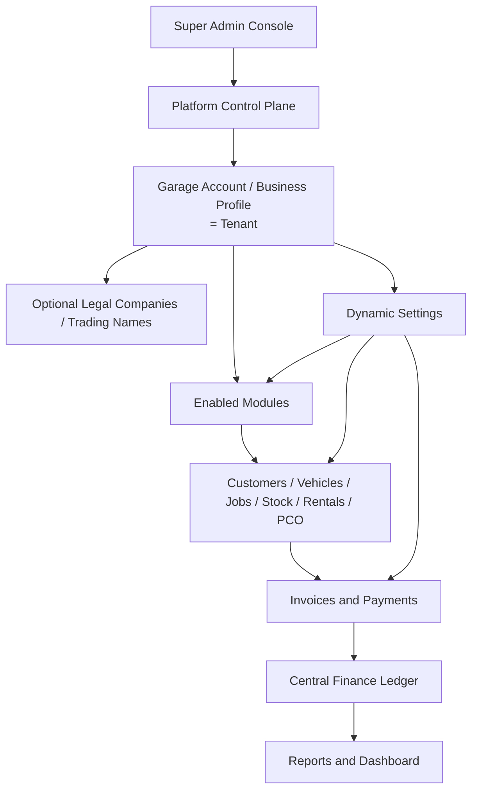
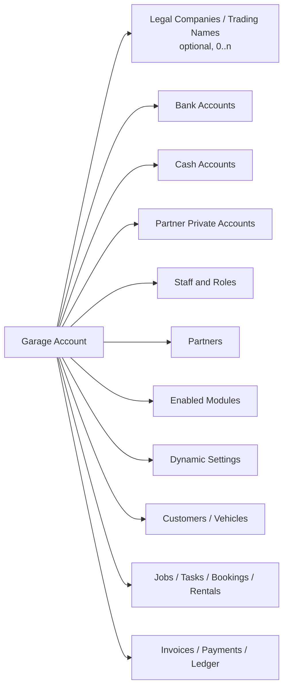
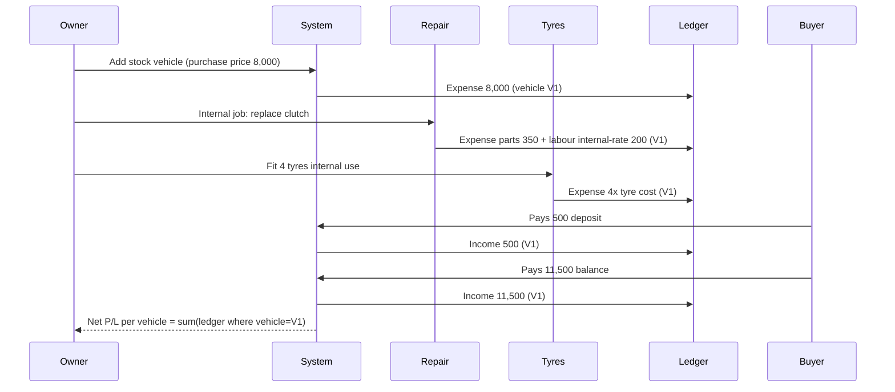
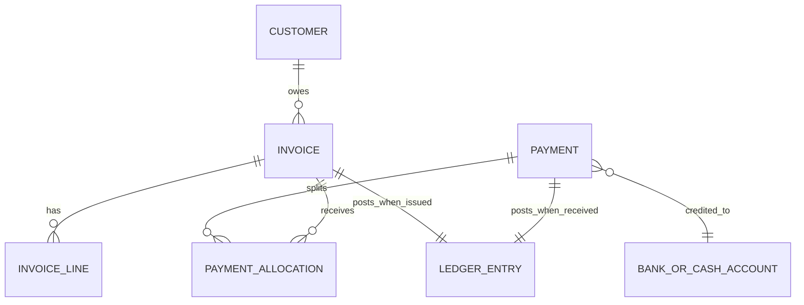
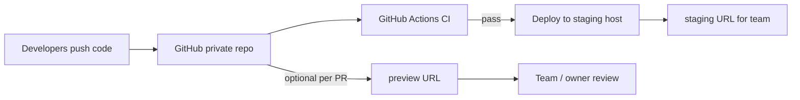

# MyGaragePro — Project Plan & Software Requirements Document

**Version:** 1.0 (MVP scope frozen, Phase 2/3 outlined)
**Document type:** Combined Project Plan + Software Requirements Specification (SRS)
**Audience:** Software development team, technical architect, product owner
**Last updated:** 2026-05-08 (§25 gated module-by-module delivery)

> Companion document: see [PROGRESS.md](PROGRESS.md) for build status, decisions and changelog.

---

## 1. Executive Summary

MyGaragePro is a modular, multi-tenant SaaS platform for independent garages and small automotive groups in the UK. It unifies operations that today live in spreadsheets, WhatsApp groups and disconnected POS tools — used-car sales, mechanical repair, bodywork, tyres, parts, PCO admin, vehicle rentals, partner investment and a single source-of-truth finance ledger.

The architecture deliberately rejects "one company = one tenant". Instead, a single **Garage Account / Business Profile** is the tenant, and legal companies / trading names are an *optional* dimension below it. This matches how owner-operated garage groups actually run: one team, one yard, multiple VAT numbers / trading names used for invoicing.

The product will first be deployed for the founding garage (single tenant) and then opened up as SaaS to other garages, sold by enabled-module subscription packages controlled by Super Admin.

**Headline objectives**
- One Garage Account, optional legal companies, every transaction landing in one ledger.
- Module-based per-tenant licensing controlled by Super Admin.
- Configurable partner equity model (0..N partners, any split ratio, equal-split default) with **separate** capital, drawings, reimbursements and profit-entitlement sub-ledgers per partner.
- Mobile-first task execution for mechanics, body staff, tyre fitters and PCO admin.
- Account customers (weekly/monthly) with payment allocation across many invoices.

---

## 2. System Goals

| # | Goal | Success measure |
|---|------|-----------------|
| G1 | Replace spreadsheets across all 9 service lines | All daily ops captured in app within 30 days of go-live |
| G2 | Single source of truth for profit/loss | Owner can answer "what did I make this week?" in <10 sec |
| G3 | Module-based SaaS ready for resale | New garage onboarded + modules toggled in <30 min by Super Admin |
| G4 | Strict capital vs profit-share separation for partners (works for sole-owner, 2-partner, 3-partner, N-partner garages with any split ratio) | Each partner has 4 distinct balances (capital, drawings, reimbursements, profit entitlement) reconcilable to ledger; sole-owner tenants can disable the module entirely |
| G5 | Mobile execution by floor staff | 80%+ of repair/body tasks status-updated from mobile |
| G6 | Account-customer billing | Weekly/monthly statements + multi-invoice payment allocation working end-to-end |
| G7 | Audit-grade finance | Every ledger entry traceable to user, approver, source module and attachment |

---

## 3. Recommended System Architecture

### 3.1 High-level diagram



### 3.2 Architectural principles
1. **Tenant = Garage Account**, not legal company. `legal_company_id` is a *nullable optional column* on every transactional table.
2. **Every money event hits the ledger.** No module is allowed to write income/expense without producing a `ledger_entry`. Enforced at service layer + DB trigger.
3. **Modules are feature flags per tenant**, not separate codebases.
4. **Capital ≠ Profit.** Partner capital, drawings, reimbursements and profit entitlement live in 4 separate sub-ledgers and never cross-contaminate.
5. **Soft delete + audit log everywhere** for operational and finance records.
6. **Approval workflow on sensitive finance edits** — staff create, manager checks, owner approves, only then ledger marks `status = posted`.

### 3.3 Logical components
- **Web app** (admin, owner, manager, accountant) — desktop-first responsive.
- **Mobile-friendly PWA** (mechanics, body staff, tyre fitters, PCO admin) — installable on iOS/Android home screen, push via web push.
- **Background workers** — invoice PDF generation, scheduled reminders, statement runs, ledger projections.
- **Object storage** — attachments (photos, invoices, V5C, HPI, MOT, signed agreements).
- **Identity & RBAC service** — module-aware permission checks.

---

## 4. SaaS / Multi-Tenant Structure

### 4.1 Tenancy model
**Shared database, shared schema, `garage_account_id` on every row.** Recommended over schema-per-tenant for:
- Cheaper to run for small garages.
- Easier cross-tenant Super Admin reporting.
- Simpler migrations.

Row-Level Security (RLS) in Postgres enforces tenant isolation. Application sets `app.current_garage_account_id` per request; all policies filter on it. Super Admin bypasses RLS only when explicit support access has been granted by the Garage Owner (time-boxed token).

### 4.2 Subscription / module packages
- Super Admin defines **Module Packages** (e.g. *Starter*: Customers + Repair + Invoices; *Workshop Pro*: + Bodywork + Parts + Tyres; *Full Group*: + Used Cars + Rental + PCO + Partners).
- Per-garage overrides allowed (enable/disable individual modules outside a package).
- Package change → effective from next billing cycle, with grace read-only access to disabled modules' historical data.

### 4.3 Super Admin scope
- CRUD garage accounts, suspend/activate.
- Toggle modules per garage.
- Define & assign subscription packages.
- Global settings (default VAT rates, default job statuses, system templates).
- Usage analytics (storage, MAU, invoices/month) — **counts only, no financial values**.
- Time-boxed support access requiring owner approval, fully audit-logged.

---

## 5. Garage Account / Business Profile Structure

A single Garage Account contains:



**Garage Account fields:** name, owner user, primary address, default VAT scheme (standard / margin scheme / not-registered), default currency = GBP, branding (logo, accent colour), default invoice template, subscription package, status (active/suspended/trial).

---

## 6. Optional Legal Company / Trading Name Structure

Each Legal Company is a child of the Garage Account and represents a billing identity:
- Registered name, trading name, company number, VAT number, VAT scheme override, registered address, contact, default bank account, invoice prefix, invoice number sequence, footer/T&Cs, signature image, active flag.

**Rules:**
- A Garage Account with zero legal companies is valid → invoices use the Garage Account's own details.
- Every transactional entity (vehicle, job, invoice, ledger entry) carries a *nullable* `legal_company_id`. This is what lets you slice profit by trading name.
- Inter-company / inter-trading-name transfers are first-class ledger events (see §17.6).

---

## 7. User Types and Permissions

### 7.1 Roles (system-defined, per Garage Account except Super Admin)
- Super Admin (platform)
- Garage Owner / Director
- Manager
- Mechanic
- Bodywork Staff
- Tyre Fitter
- PCO Admin
- Accountant
- Read-only User

### 7.2 Permission model
- **Module × Action** matrix (e.g. `repair.job.create`, `finance.ledger.approve`, `partner.drawing.create`).
- Permissions grouped into role templates; per-user overrides allowed.
- **Sensitive actions** (approve expense, edit posted ledger, delete invoice, partner drawing, refund, write-off) require an `approver_user_id` in addition to the actor.
- Read-only role: every `*.read` permission, zero writes.

### 7.3 Permission examples (must be enforced)
- Mechanic: `repair.task.*` on their own tasks, `parts.consume`, `tyres.consume`, no finance reads beyond own job totals.
- Bodywork Staff: same, scoped to bodywork module.
- PCO Admin: `pco.*`, `customer.read`, `invoice.create` for PCO services only.
- Accountant: `ledger.read`, `report.*`, `invoice.read`, `expense.create`; cannot delete operational records.
- Manager: assign tasks, approve jobs, approve small expenses up to a configurable threshold.
- Owner: everything in their tenant; can override.
- Super Admin: tenant lifecycle + modules; **no read on financial values** unless support access granted.

---

## 8. Module-by-Module Requirements

For brevity each module lists: **purpose · key entities · workflows · ledger touchpoints · KPIs**. Field lists are in §9.

### 8.1 Used Car Buy & Sell (Module: `used_cars`)
- **Purpose:** Track each stock vehicle from purchase to sale with full cost build-up.
- **Workflow:** Purchase → preparation (repairs, body, MOT, valet, parts, tyres, advertising) → advert → sale (deposit, finance, balance, part-ex) → handover → post-sale (warranty, refunds).
- **Ledger:** Every prep cost = expense entry tagged `vehicle_id`. Every sale component = income entry. Net P/L per vehicle = sum of ledger entries scoped to vehicle.
- **KPIs:** ROI %, days in stock, gross margin, VAT/margin scheme handling, loss-making list, top performers.

### 8.2 Partner Investment & Profit Share (Module: `partners`)
- **Configurable per Garage Account**: enable/disable, 0..N partners, split rule (equal / by-percentage / by-capital-ratio / custom-per-distribution). Sole-owner tenants disable the module.
- See §17 for full design.

### 8.3 Customer Management (Module: `customers`)
- **Purpose:** Unified customer record, individual or business; account-customer support.
- **Workflow:** Create customer → link vehicles → link jobs/invoices → statements → payments → allocation.
- **Account customers:** weekly or monthly billing cycle, credit limit, payment terms (Net 7/14/30), automated statement on cycle close.
- **Ledger:** Customer balance = sum(invoices) - sum(allocated payments). Aged debt buckets 0/30/60/90+.

### 8.4 Mechanical Repair (Module: `repair`)
- **Purpose:** Job-card system from intake to invoice.
- **Workflow:** New → Awaiting diagnostic → Diagnostic done → Quote sent → Customer approval → Parts ordered → In progress → Awaiting payment → Ready for collection → Completed (or Cancelled).
- **Job sources:** customer | internal stock car | rental vehicle | warranty company. Source determines who pays and which sub-ledger absorbs cost.
- **VAT:** Per-job toggle; if on, system applies tenant or legal-company default rate but allows override.
- **Ledger:** Labour income, parts income, parts cost (COGS), subcontractor expense, recovery expense.

### 8.5 Bodywork (Module: `bodywork`)
- Mirrors repair structure but with panel/colour/code, before/after photos, customer vs insurance vs internal flag, paint/material cost, outsourced cost, customer approval gate before paint.

### 8.6 Task Management (Module: `tasks`, cross-cutting)
- Tasks belong to a parent job (repair or bodywork) and roll up to it.
- Statuses: Available · Assigned · Accepted · Started · Paused · Waiting for parts · Waiting for approval · Completed · Cancelled.
- "Self-claim" rule: a task can be picked up by an authorised mechanic only if `assignee IS NULL`, status = Available, the user holds the matching skill permission, and the parent job is approved to start.
- Time tracking: each Start/Pause emits a `task_time_entry`; total labour cost on the job is the sum of entries × user labour rate.

### 8.7 Mobile App / PWA (Module: `mobile`)
- Single PWA, role-aware home screen.
- Offline-tolerant for task status changes and photo uploads (queue + retry).
- Web push notifications for the events listed in the brief (task assigned/updated/started/completed, waiting parts/approval, ready for collection, payment overdue, low stock, customer approval, manager approval needed).

### 8.8 Tyre Stock (Module: `tyres`)
- Inventory by brand/model/size/load/speed/new-or-partworn.
- Sale event auto-decrements stock and posts: tyre sale income, tyre COGS, fitting/balancing/valve/disposal income lines.
- Reminders: low stock, popular size running low, slow movers, unpaid supplier invoice, count overdue, price review.

### 8.9 Parts Stock (Module: `parts`)
- Used by repair, bodywork, internal prep, rental repairs.
- Selecting a part on a task: decrement stock, post COGS to job, add line to invoice at sell price.
- Part returns (unused on job): increment stock, reverse postings.

### 8.10 PCO Booking (Module: `pco`)

> **Implemented spec:** See [docs/PCO_MODULE.md](./PCO_MODULE.md) and [docs/PROGRESS.md](./PROGRESS.md) § PCO module. The bullets below are original plan context; the built product uses a two-step **Add request → To book → Active** workflow, job types including Retest/Reschedule, 28-day due lists, and ledger-only income (no invoice PDF).

- Customer-light record: registered name, licence, expiry, preferred centres.
- Job types: admin · booking · retest · renewal · document upload · other.
- Statuses: New · Awaiting documents · Documents received · Booking required · Booked · Awaiting appointment · Retest required · Completed · Cancelled · Refunded.
- Past jobs remain searchable (no archive deletion).

### 8.11 Rental (Module: `rental`)
- Rental agreement record + recurring weekly rent schedule.
- Auto-generates a "rent due" event on the agreement's payment day; arrears are calculated nightly.
- Repair, MOT, tyres, recovery, bodywork, road tax, insurance against rental vehicle = expenses on rental P/L.
- Driver-side: arrears, deductions from deposit, PCN/admin charges.

### 8.12 Invoice System (Module: `invoicing`) — see §12.

### 8.13 Payment Allocation (Module: `payments`) — see §12.3.

### 8.14 Central Finance Ledger (Module: `ledger`) — see §16.

### 8.15 Reports (Module: `reports`) — see §13.

### 8.16 Documents & Attachments (cross-cutting)
- Polymorphic `attachments` table linked to any entity (vehicle, job, task, invoice, ledger entry, customer, partner, rental, PCO).
- Object storage with signed URLs; mime/size validation; virus scan in Phase 2.

### 8.17 Stock Adjustment (Module: `stock_adjust`)
- One screen for tyres and parts. Records before/after qty, reason (mistake, damaged, returned, lost, count), adjuster, approver, notes. Posts a COGS write-off ledger entry where appropriate.

### 8.18 Dashboard (cross-cutting) — see §18.

### 8.19 Suppliers (Module: `suppliers`)
- Supplier master + supplier invoices + supplier balances + payments to suppliers (mirror of customer side).

### 8.20 Cash Control (Module: `cash`)
- Daily cash drawer open/close per cash account, with declared count, system count, variance, approver.

---

## 9. Data Fields per Module

The brief already enumerates required fields per module. The implementation MUST accept all listed fields. To avoid duplication, the developer should treat the user's brief sections (Used Cars, Partner, Customer, Repair, Body, Task, Tyres, Parts, PCO, Rental, Invoice, Ledger) as the canonical field list, plus the system-required additions below on every transactional row:

- `id` (uuid), `garage_account_id` (uuid, NOT NULL), `legal_company_id` (uuid, NULL),
- `created_at`, `updated_at`, `created_by`, `updated_by`,
- `deleted_at`, `deleted_by` (soft delete),
- `version` (optimistic locking) for finance-sensitive rows.

Every money-bearing row also carries: `currency` (default GBP), `vat_applicable` (bool), `vat_rate_id` (FK), `vat_amount`, `net_amount`, `gross_amount`, `payment_account_id` (FK to bank/cash), `category_id` (FK to dynamic settings).

---

## 10. Workflow Examples

### 10.1 Used car prep → sale → ledger



### 10.2 Account customer (business) — multi-invoice payment allocation
1. Business customer "ABC Cabs Ltd" has 4 open invoices (£250, £180, £120, £450 = £1,000).
2. They send £1,000 bank transfer to the *Trading Name "QuickFix Garage Ltd"* bank account.
3. User opens **Receive Payment** → picks customer → enters £1,000 → bank account.
4. System suggests auto-allocate oldest first; user can override per-invoice amount.
5. On submit: 4 `invoice_payment` rows + 1 `ledger_entry` (income, allocated to legal company, payment account). Each invoice transitions to `Paid`.
6. If they had paid £700, system marks invoices 1–3 paid and invoice 4 part-paid (£150 of £450).

### 10.3 Mechanic mobile flow
Login → Home shows assigned tasks + available tasks → Tap task → Accept → Start (timer running) → Add parts from stock (decrements) → Pause for lunch → Resume → Upload photo → Complete → Manager auto-notified. Job rolls up totals.

### 10.4 Expense approval workflow
Staff adds £400 recovery expense with receipt photo → status `pending`. Manager checks receipt → status `checked`. Owner approves → ledger posts as `posted`. All 3 user IDs and timestamps are stored in audit log.

### 10.5 Partner drawing (illustrative — partner count and split rule are tenant-configurable, see §17)
Owner records: Partner A drawing £5,000 from "Profit Entitlement" sub-ledger → drawings sub-ledger +£5,000, profit-entitlement sub-ledger -£5,000, payment account -£5,000. Capital sub-ledger untouched. Same flow applies whether the tenant has 1, 2, 3 or N partners.

---

## 11. Customer & Business Customer Account Management

### 11.1 Account-customer feature set
- Toggle "Account customer" → unlocks: payment terms (Net 0/7/14/30/custom), credit limit, billing cycle (per-job / weekly / monthly), statement day, default invoice template, allow/deny new jobs when over limit.
- Statements: scheduled job runs at billing cycle close; produces a single PDF aggregating all invoices in the period plus aged-debt summary; emailed and/or downloadable.
- Overdue: system flags customer when any invoice exceeds payment terms; dashboard widget + warning banner on new job creation.

### 11.2 Statement vs invoice
- An **invoice** is a billable document for one job (or bundle).
- A **statement** is a snapshot of customer ledger over a date range. Statements never replace invoices and never post to ledger.

---

## 12. Invoice & Payment Allocation System

### 12.1 Invoice
- Numbering: per-legal-company sequence with configurable prefix (e.g. `QFG-2026-00045`); fallback to garage-account sequence if no legal company chosen.
- Statuses: Draft · Sent · Part-paid · Paid · Overdue · Cancelled · Refunded · Written off.
- Lines: labour, parts, tyres, sublet, fees, discount, other; each line has VAT toggle and rate.
- VAT scheme: standard, margin scheme (used cars), exempt, not-registered. Affects display and report.
- PDF render: server-side from a versioned template (so historical PDFs don't change if template later edited).

### 12.2 Invoice creation sources
Single repair job · bodywork job · tyre sale · parts sale · PCO service · rental rent run · used-car sale · monthly/weekly business customer statement (rolls multiple jobs into one invoice).

### 12.3 Payment allocation
- A `payment` is the receipt event (amount, date, payment account, payer, method, reference, attachment).
- A `payment_allocation` row links a payment to one invoice with an amount; sum of allocations ≤ payment amount.
- Unallocated balance becomes "customer credit" on the customer record, available for future invoices.
- Reverse: an allocation can be undone (audit-logged, owner permission), invoice statuses recompute.



---

## 13. Reporting Requirements

The full list in the brief is in scope. Group them as follows:

- **Profitability:** daily/weekly/monthly/quarterly/yearly P/L; by legal company; by module; by vehicle; by repair job; by rental car; by PCO job; by tyre sales; by parts; custom date range.
- **Partners:** investment, withdrawals, capital balance, drawings balance, profit entitlement balance, profit allocation history.
- **Cash & banks:** account balances, payments received by account, daily cash close report.
- **AR / AP:** customer balance, supplier balance, invoice ageing, paid/unpaid/part-paid/overdue jobs, business customer statement.
- **Operations:** worker productivity (tasks completed, hours, rework rate), stock ageing (parts/tyres), vehicle stock ageing.
- **Tax:** VAT report (standard scheme), margin-scheme report.

All reports must support: filter by date range, legal company, module, payment account; CSV + PDF export; saved-views.

---

## 14. Dynamic Settings Requirements

Implement as a generic `settings_option` table keyed by `(garage_account_id, option_type, value)` with display order, active flag, and optional metadata JSON. Owner-editable types:

Legal companies/trading names · Bank accounts · Cash accounts · Partner personal accounts · Payment methods · Expense categories · Income categories · Job statuses · Task statuses · PCO centres · PCO job types · Repair job types · Bodywork job types · Tyre brands · Tyre sizes · Parts categories · VAT rates · Suppliers · Staff roles · Warranty providers · Vehicle purchase sources · Document templates · Invoice templates · Notification templates.

Seed every new tenant with a sensible default set; owner can edit/disable but not delete if referenced (only deactivate).

---

## 15. Mobile App Requirements

- **Form factor:** Installable PWA first; native shell (Capacitor) optional in Phase 3 only if push reliability becomes an issue.
- **Roles supported:** Mechanic, Bodywork Staff, Tyre Fitter, Manager, PCO Admin.
- **Capabilities:** task list (assigned + available), accept/start/pause/complete, photo/video upload (compressed client-side), part/tyre selection with stock check, request parts, request approval, labour timer, status updates, push notifications, offline queue.
- **Notifications:** task assigned/updated/started/completed; waiting parts/approval; ready for collection; payment overdue; low stock; part/tyre used; customer approved quote; manager approval needed.
- **Security:** short-lived JWT, refresh on focus, biometric unlock (Phase 2).

---

## 16. Finance Ledger Design

### 16.1 Single table, double-coded

```
ledger_entry(
  id, garage_account_id, legal_company_id NULL,
  posted_at, value_date,
  direction ENUM(income, expense),
  amount_net, vat_amount, amount_gross, currency,
  payment_account_id NULL,         -- bank/cash account that moves
  partner_account_id NULL,         -- for partner-related events
  source_module ENUM(used_cars, repair, bodywork, tyres, parts, pco, rental, general, partner, transfer, adjustment),
  source_entity_type, source_entity_id,
  vehicle_id NULL, job_id NULL, customer_id NULL, supplier_id NULL,
  worker_id NULL, partner_id NULL,
  category_id, payment_method_id,
  status ENUM(pending, checked, posted, void),
  created_by, checked_by NULL, approved_by NULL, voided_by NULL,
  attachment_id NULL, notes,
  reverses_entry_id NULL
)
```

### 16.2 Rules
- No edits after `posted`. Corrections are reversal entries that point to the original via `reverses_entry_id`.
- `void` is a soft-cancel of a `pending`/`checked` entry; never used after `posted`.
- Every transactional table includes a service-level call to `Ledger.post(...)`; DB trigger blocks writes that omit `garage_account_id`.

### 16.3 Approval workflow
`pending` (staff) → `checked` (manager, optional unless above threshold) → `posted` (owner/director or auto if below threshold). Threshold per category, configurable.

### 16.4 P/L slicing
P/L = Σ(income.amount_net) - Σ(expense.amount_net), filterable on any combination of `legal_company_id`, `vehicle_id`, `job_id`, `customer_id`, `worker_id`, `partner_id`, `payment_account_id`, `source_module`, `payment_method_id`, `value_date` range.

---

## 17. Partner Investment & Profit Share Design

The partner module is **fully configurable per Garage Account** — it must work for sole owners, 2-partner shops, 3-partner shops (founding garage), and N-partner groups, with arbitrary split ratios. No partner counts, names, or split percentages may be hard-coded anywhere in the system.

### 17.1 Configuration model
Per Garage Account:
- **Partners enabled**: bool. Sole-owner tenants set this to *off* and the module + dashboard widgets disappear. (Owner can still record their own drawings against an "Owner" pseudo-partner if desired.)
- **Partners list**: 0..N rows of `partner(id, garage_account_id, display_name, legal_name, joined_on, left_on NULL, active, notes)`.
- **Profit split rule** (per Garage Account, versioned over time):
  - `kind` ∈ { `equal`, `by_percentage`, `by_capital_ratio`, `custom_per_distribution` }.
  - If `by_percentage`: `partner_split(partner_id, percentage)` rows; sum must equal 100.0000 (4-dp tolerance).
  - If `by_capital_ratio`: computed at distribution time as each partner's capital balance ÷ total capital balance.
  - If `equal`: 100 / count(active partners) at distribution time.
  - If `custom_per_distribution`: owner enters per-partner amounts/percentages on each distribution run; sum validated.
- **Effective dating**: a split rule has `effective_from` and is replaced (not edited) when changed, so historic distributions stay reproducible.
- **Approval policy**: distributions and drawings always require owner/director approval; threshold-based dual control optional.

### 17.2 Four sub-ledgers per partner
1. **Capital** — money put into the business.
2. **Drawings** — money taken out as profit distribution.
3. **Reimbursements** — partner paid a business cost from personal funds → business owes them.
4. **Profit Entitlement** — accrued share of declared profit, not yet drawn.

`partner_account_balance(partner_id, account_kind, balance)` is a materialised view over `partner_ledger_entry`.

Capital balances are individual and never equalised across partners — capital and profit share are intentionally decoupled (so a partner who put in more capital does not automatically get more profit unless the split rule explicitly says so).

### 17.3 Profit distribution flow
1. Owner opens **Profit Distribution** for a date range (or "since last distribution").
2. System computes net P/L from the central ledger for the period, scoped to the chosen `legal_company_id` (or All).
3. System looks up the active split rule on the period's end date and proposes per-partner amounts.
4. Owner can adjust (within the rule's constraints, or override if rule is `custom_per_distribution`).
5. On approval, system posts one `partner_ledger_entry` of type `profit_entitlement +X` per partner, all linked to a single `profit_distribution(id, period_from, period_to, total_profit, rule_snapshot_json, approved_by, approved_at)` parent for audit.

### 17.4 Drawings, reimbursements, capital events
- **Capital +**: payment_account +X, capital +X (partner brings money in).
- **Capital -**: capital -X, payment_account -X (partner repaid capital — rare, owner-approved).
- **Drawing**: payment_account -X, drawings +X, profit_entitlement -X. Only allowed up to current profit entitlement balance (soft warning + owner override allowed and audit-flagged if exceeded).
- **Reimbursement record**: business expense posted as normal + reimbursements payable +X to partner.
- **Reimbursement settle**: payment_account -X, reimbursements -X.

### 17.5 Worked examples (illustrative — not hard-coded)

*Example A — sole owner:* Partners enabled = off. Module hidden. Owner records drawings against an optional "Owner" pseudo-partner if useful for personal P/L tracking.

*Example B — 2 partners 60/40:* Rule `by_percentage`, A=60, B=40. £100k profit → A gets £60k, B gets £40k profit entitlement. Capital balances independent.

*Example C — 3 partners equal split, unequal capital (founding garage shape):* Capital A=£50k, B=£30k, C=£20k. Rule `equal`. £90k profit → each partner +£30k profit entitlement. Capital balances unchanged. A withdraws £10k → A's drawings +£10k, profit entitlement £20k, capital still £50k, payment account -£10k.

*Example D — 4 partners by capital ratio:* Capital A=£100k, B=£50k, C=£30k, D=£20k → ratios 50/25/15/10. £200k profit → A £100k, B £50k, C £30k, D £20k.

### 17.6 Inter-company / inter-trading-name transfers
First-class ledger event with two paired entries (`source_module = transfer`), one negative on source legal company and payment account, one positive on destination. Cancels out at group level. Independent of the partner module.

---

## 18. Dashboard

Role-aware dashboard widgets:

- **Owner / Manager:** today's income, today's expenses, monthly profit, cars in stock, cars sold this month, open repair jobs, open bodywork jobs, pending PCO jobs, rental arrears, unpaid invoices, overdue invoices, low tyre stock, low parts stock, expenses awaiting approval, partner balances (capital, drawings, profit entitlement, reimbursements), cash/bank balance summary.
- **Mechanic / Body / Tyre / PCO:** my tasks, available tasks, my completed today, parts/tyres I requested, approvals waiting on me.
- **Accountant:** pending entries, overdue invoices, VAT period to date, bank/cash balances, expenses awaiting approval.

---

## 19. MVP Scope

Goal: ship the founding garage with everything required to run day-to-day and bill correctly, delivered **one gated module at a time** (§25) so each module is tested on staging before the next starts. Indicative total **15–20 weeks** (flexible per gate sign-off).

**MVP modules (must-have):**
1. Auth, roles, permissions, tenants, dynamic settings, audit log, soft delete.
2. Customer Management (incl. account customers).
3. Mechanical Repair (full job-card + statuses + VAT).
4. Tyre Stock (incl. sale).
5. Parts Stock (incl. consumption to job).
6. Invoice System + PDF.
7. Payment Allocation.
8. Central Finance Ledger.
9. Suppliers + supplier invoices.
10. Cash control (daily close).
11. Rental (basic: agreement, weekly rent run, expenses, arrears).
12. Used Car Buy & Sell.
13. Partner Investment & Profit Share — configurable per tenant: 0..N partners, split rules (equal / by-percentage / by-capital-ratio / custom-per-distribution), 4 sub-ledgers per partner, profit distribution workflow, sole-owner mode disables module.
14. Reports — daily/weekly/monthly/yearly P/L, by vehicle/job/module/legal company, customer balance, supplier balance, VAT report, invoice ageing.
15. Dashboard (owner/manager + mechanic).
16. Mobile-friendly PWA for mechanics + tyre fitters (task self-claim, start/pause/complete, parts/tyres consumption, photo upload, push).
17. Documents & attachments.
18. Stock adjustment.
19. Super Admin: tenant CRUD, module toggles, packages, suspend, support-access workflow.

---

## 20. Phase 2 Features

- Bodywork module (full).
- PCO Booking module (full).
- Margin scheme reporting.
- Customer portal (self-service: view jobs, approve quotes, pay invoices).
- Driver portal (rental: see rent, balance, agreement).
- Digital signature on rental & sale agreements.
- SMS reminders (Twilio) + WhatsApp Business templates.
- Email reminders (transactional) at scale.
- QuickBooks / Xero export (CSV) then API.
- Barcode / QR stock scanning (PWA camera).
- HMRC MTD VAT submission.

## 20a. Phase 3 Features

- Native mobile shell (Capacitor) if push reliability requires it.
- Public REST/GraphQL API for third-party integrations.
- AI-assisted quote drafting & cost estimation from photos.
- Multi-currency / multi-region.

---

## 21. Recommended High-Level Database Structure

Postgres 15+. Core tables (non-exhaustive, MVP):

- **Platform:** `users`, `garage_account`, `garage_account_module` (enabled flag), `module_package`, `subscription`, `support_access_grant`, `audit_log`, `notification`, `attachment`, `setting_option`, `vat_rate`.
- **Org:** `legal_company`, `bank_account`, `cash_account`, `partner`, `partner_private_account`, `partner_ledger_entry`, `partner_split_rule` (effective-dated), `partner_split` (rows for `by_percentage`), `profit_distribution` (parent), `staff_role`, `staff_user_link`, `permission`, `role_permission`, `user_permission_override`.
- **Customers:** `customer` (type=individual|business), `customer_vehicle`, `customer_account_terms`.
- **Suppliers:** `supplier`, `supplier_invoice`, `supplier_payment`.
- **Stock:** `tyre`, `tyre_movement`, `part`, `part_movement`, `stock_adjustment`.
- **Vehicles & jobs:** `stock_vehicle` (used car), `repair_job`, `bodywork_job`, `task`, `task_time_entry`, `job_part`, `job_tyre`, `job_sublet`, `pco_record`, `pco_booking`, `rental_agreement`, `rental_rent_run`, `rental_expense`.
- **Money:** `invoice`, `invoice_line`, `payment`, `payment_allocation`, `ledger_entry`, `cash_close`.
- **Approval:** `approval_request`, `approval_step`.

Every transactional table: `garage_account_id` NOT NULL, `legal_company_id` NULL, soft-delete columns, audit columns. RLS policy on every table: `garage_account_id = current_setting('app.current_garage_account_id')::uuid`.

---

## 22. Recommended Technology Stack

- **Backend:** Node.js (TypeScript) + NestJS, or alternatively Python + Django/DRF if the team prefers. Preference: **NestJS** for modular feature-flagged structure (matches "modules" mental model 1:1).
- **Database:** PostgreSQL 15+ with Row-Level Security; Prisma or TypeORM.
- **Background jobs:** BullMQ (Redis) for invoice PDFs, statement runs, rental rent runs, reminders, ledger projections.
- **Web (admin/owner):** Next.js (App Router) + TypeScript + TanStack Query + Tailwind + shadcn/ui.
- **Mobile (staff PWA):** Same Next.js codebase as a `/m` shell, or a thin separate Next.js app sharing the API; service worker + Workbox for offline + push.
- **Auth:** Self-hosted (Auth.js / Passport) with email + password (no 2FA in v1, but architect for TOTP in Phase 2). Short-lived JWT + refresh.
- **Storage:** S3-compatible (AWS S3 or Cloudflare R2). Signed URLs.
- **Notifications:** Web Push (VAPID) for in-app + transactional email via Postmark/SES; SMS in Phase 2 via Twilio.
- **PDF:** Server-side via Puppeteer or @react-pdf/renderer; templates versioned.
- **Hosting:** Containerised (Docker) on AWS ECS/Fargate or Fly.io for MVP; Postgres on RDS/Neon; Redis on Elasticache/Upstash; S3/R2 for blobs.
- **Observability:** Sentry (errors), OpenTelemetry → Grafana Cloud or Datadog (traces/metrics), structured logs.
- **CI/CD:** GitHub (private repo) + GitHub Actions on every PR; auto-deploy **staging** from `main` and optional **preview** per PR so the team can test in a browser during the build (see §25a).
- **Testing:** Vitest/Jest unit, Playwright E2E for critical flows (invoice → payment → ledger → P/L).

---

## 23. Security & Audit Requirements

- All connections HTTPS only; HSTS; secure cookies.
- Passwords: argon2id; password reset via signed email links.
- Rate limiting on login + password reset.
- RBAC enforced server-side on every endpoint (no client-only checks).
- RLS in Postgres as defence-in-depth.
- **Audit log** immutable append-only table for: login, logout, permission change, settings change, finance entry create/check/approve/void, invoice create/edit/cancel/refund/write-off, payment allocate/unallocate, partner ledger event, stock adjustment, attachment upload/delete, support-access grant/use, soft-delete/restore.
- **Deleted-item history**: soft delete with restore UI for owner; hard delete forbidden via app, only via DBA with owner approval.
- **Sensitive finance approval**: configurable thresholds; dual control on void/write-off/refund/partner drawing.
- **Backups:** daily encrypted, 30-day retention, quarterly restore drill.
- **PII**: customer DOBs, addresses, driving licence images encrypted at rest (column-level for IDs; bucket-level for blobs).
- **GDPR:** customer data export + erasure (with finance retention exemption — invoices retained 6 years per HMRC).
- **Super Admin support access**: time-boxed (max 24h), explicit owner approval token, all reads/writes audit-logged with banner shown to garage staff.

---

## 24. Recommended Extra Features (industry-specific)

Beyond the user's list, recommended for this domain:

- **HPI / DVLA reg lookup integration** — auto-populate make/model/MOT/tax/V5C dates on entry.
- **PCO TfL retest deadline auto-calc** with countdown and reminder cadence (T-14, T-7, T-1).
- **MOT/insurance/road-tax expiry tracker** for stock + rental fleet — dashboard alert.
- **Mileage capture on intake/handover** with photo, used to flag warranty disputes.
- **Internal labour cost rate per technician** (separate from charge-out rate) so internal-job profitability is real.
- **Cost build-up vs sale ceiling** on stock vehicles — alert when prep costs threaten target margin.
- **Inter-vehicle stock transfer** (e.g. tyres unbolted from one used-car and fitted to another) — preserves traceability.
- **Warranty register**: which warranty provider covers which sold car, with claim workflow.
- **Customer contactability**: marketing-consent flag; "do not call" honoured.
- **Quote-vs-actual variance report** on repair jobs to coach pricing accuracy.
- **Operator KPI for tyre fitters**: tyres fitted/hour, miss-balances reported.
- **Recovery vendor management** with cost rate cards.
- **Configurable invoice "bill to" rule**: rental driver, business customer parent, insurer.
- **Bank import (CSV → Phase 2 OpenBanking)** with matching to existing payments/expenses.
- **Year-end pack export** for accountant: trial balance, P/L, ledger CSV, VAT detail, fixed asset register stub.

---

## 25. Delivery Plan — Gated, module-by-module (test before next)

**Delivery rule (agreed):** Build **one module (or tight group) per phase**, deploy to **staging**, you **test and sign off**, then we start the next phase. No parallel “big bang” drops. Timeline is **indicative per gate** (~1–2 weeks each); total MVP may exceed 12 weeks if gates need more UAT time — that is expected and preferred over rushing.

```mermaid
flowchart TD
    P0[Phase 0: Staging + UI shell] --> G0{Sign-off?}
    G0 -->|Yes| P1[Phase 1: Auth + settings + Super Admin]
    P1 --> G1{Sign-off?}
    G1 -->|Yes| P2[Phase 2: Customers]
    P2 --> G2{Sign-off?}
    G2 -->|Yes| P3[Phase 3: Suppliers]
    P3 --> G3{Sign-off?}
    G3 -->|Yes| P4[Phase 4: Ledger + banks/cash]
    P4 --> G4{Sign-off?}
    G4 -->|Yes| P5[Phase 5: Invoices + payments]
    P5 --> G5{Sign-off?}
    G5 -->|Yes| P6[Phase 6: Repair jobs + tasks]
    P6 --> G6{Sign-off?}
    G6 -->|Yes| P7[Phase 7: Parts stock]
    P7 --> G7{Sign-off?}
    G7 -->|Yes| P8[Phase 8: Tyre stock]
    P8 --> G8{Sign-off?}
    G8 -->|Yes| P9[Phase 9: Mechanic PWA]
    P9 --> G9{Sign-off?}
    G9 -->|Yes| P10[Phase 10: Used cars]
    P10 --> G10{Sign-off?}
    G10 -->|Yes| P11[Phase 11: Partners]
    P11 --> G11{Sign-off?}
    G11 -->|Yes| P12[Phase 12: Rental]
    P12 --> G12{Sign-off?}
    G12 -->|Yes| P13[Phase 13: Reports + dashboard]
    P13 --> G13{Sign-off?}
    G13 -->|Yes| P14[Phase 14: Cash + stock adjust + polish]
    P14 --> G14{Sign-off?}
    G14 -->|Yes| P15[Phase 15: Go-live]
```



### 25.0 How a gate works

| Step | Who | Action |
|------|-----|--------|
| 1 | Dev | Complete phase scope; deploy to **staging**; post **test script** in `PROGRESS.md` |
| 2 | You (owner/manager) | Run test script on staging (desktop + phone if applicable) |
| 3 | You | Mark gate **Pass** or **Fail** in `PROGRESS.md`; log issues in GitHub Issues |
| 4 | Dev | Fix failures; redeploy; re-test **same gate** (no next phase until Pass) |
| 5 | You | Sign off → next phase starts |

**Sign-off means:** “Good enough to use this module daily on staging” — not necessarily perfect. Cosmetic tweaks can be logged as Phase 14 polish if non-blocking.

### 25.1 Phase-by-phase scope and what you test

| Phase | Module(s) | Indicative duration | You test on staging | Pass criteria (summary) |
|-------|-----------|---------------------|---------------------|---------------------------|
| **0** | Scaffolding, GitHub, staging, UI shell | ~3–5 days | Open staging URL; login screen; sidebar ☰; light/dark; empty dashboard layout | HTTPS works; deploy automatic on merge; UI matches §28 preview |
| **1** | Auth, RBAC, tenancy, dynamic settings, audit, soft delete, Super Admin (basic) | ~1–2 wks | Super Admin creates garage; owner logs in; add settings (VAT, categories); create users per role; mechanic cannot see ledger | RLS isolation; roles enforced; audit log entries visible |
| **2** | **Customers** (individual + business, vehicles, account terms) | ~1 wk | CRUD customers; link vehicles; account customer toggle; credit limit | Lists + detail work; business vs individual fields correct |
| **3** | **Suppliers** | ~3–5 days | CRUD suppliers; supplier contact fields | Supplier list/search usable |
| **4** | **Ledger** + bank/cash accounts + expense approval | ~1–2 wks | Add bank/cash; post manual income/expense; approval flow (staff→manager→owner); reversal | Ledger balances match; cannot edit posted; approval audit trail |
| **5** | **Invoices** + **payment allocation** + PDF | ~1–2 wks | Create invoice; PDF download; record payment; split across 2+ invoices; part-paid | §26 allocation scenario passes; invoice statuses update |
| **6** | **Mechanical repair** + tasks (web only) | ~1–2 wks | Full job card lifecycle; tasks; assign mechanic; job→invoice (uses Phases 2+5) | One repair job end-to-end through invoice on staging |
| **7** | **Parts stock** + job consumption | ~1 wk | Add parts; use part on job; stock decrements; cost on job/invoice | Stock qty correct; COGS in ledger |
| **8** | **Tyre stock** + tyre sale | ~1 wk | Add tyres; sell/fit on job or counter sale; low-stock alert | Tyre P/L lines in ledger |
| **9** | **Mechanic PWA** + notifications | ~1–2 wks | Phone: login, tasks, start/pause/complete, photo, pick parts (Phase 7) | Happy path ≤5 taps; works on staging HTTPS |
| **10** | **Used cars** | ~1–2 wks | Stock vehicle; prep costs; sale; per-vehicle P/L | Vehicle P/L = ledger sum |
| **11** | **Partners** (configurable) | ~1 wk | Add partners; split rule; profit distribution; drawing | Capital ≠ profit; your split rule works |
| **12** | **Rental** (basic) | ~1 wk | Agreement; weekly rent; record payment; arrears view | Rent due + payment posts to ledger |
| **13** | **Reports** + **dashboard** (live KPIs) | ~1–2 wks | P/L reports; filters; export CSV; dashboard tiles match data | Today profit matches ledger |
| **14** | Cash close, stock adjust, attachments polish, bug fixes | ~1 wk | Daily cash close; stock adjustment; upload doc on job | All gate failures closed or deferred |
| **15** | Data import, production, go-live | ~1 wk | Real data smoke test; production URL | Owner sign-off for live use |

**Explicitly after MVP gates (not blocking earlier phases):** Bodywork module, PCO module (Phase 2 product per §20).

### 25.2 What each phase must include (every time)

- Deploy to **staging** + short **test script** (numbered steps) in `PROGRESS.md`
- **Seed data** for that module only (reset staging DB allowed between early gates if needed)
- **Feature flag**: later modules hidden in nav until their gate passes (no dead menu clutter)
- **Regression**: quick smoke of previous gate (5-min checklist) before signing new gate

### 25.3 Indicative timeline (sequential, not parallel)

Rough total: **15–20 weeks** if each gate takes ~1 week UAT. Faster if sign-offs are quick; slower if gates need rework — both are fine.

| Weeks (indicative) | Phases |
|--------------------|--------|
| 1 | 0, 1 |
| 2–3 | 2, 3, 4 |
| 4–5 | 5, 6 |
| 6–7 | 7, 8, 9 |
| 8–9 | 10, 11, 12 |
| 10–11 | 13, 14, 15 |

### 25.4 Superseded plan (reference only)

The original parallel 12-week gantt assumed overlapping workstreams. **Superseded by §25.1** for execution; kept for effort estimation only.

### 25a. GitHub repository and team testing during build

**Yes — the project should live on GitHub from Phase 0**, not only at go-live. GitHub is where the team collaborates on code; a **hosted staging URL** (connected to GitHub) is what they use to test the website in a browser.

GitHub itself does not run the app (it is not a web host for NestJS + Postgres). The recommended pattern:



| Environment | Branch / trigger | Who uses it | Purpose |
|-------------|------------------|-------------|---------|
| **Local** | Developer machine | Developers | Fast iteration, Docker Compose for API + DB |
| **Preview** | Each pull request (optional) | Reviewers, product owner | Test a feature branch before merge |
| **Staging** | Every merge to `main` | Whole team (mechanics, managers, owner) | Shared “latest integrated” build for weekly testing |
| **Production** | Tagged release / manual promote | Real garage after UAT | Go-live only |

**GitHub setup (Phase 0, week 0)**
- Private repository under your organisation or personal account (recommended: **GitHub Team** or **Organisation** so you can add collaborators without sharing passwords).
- Invite developers, owner/manager (read or triage), and optionally accountants as **read-only** on Issues only.
- Branch protection on `main`: require PR + passing CI (reviews optional for a small team).
- **GitHub Issues** + **Projects** (or milestones) mapped to phases in §25 and `PROGRESS.md`.
- Secrets in GitHub Actions only (DB URL, API keys, deploy tokens) — never committed.

**What gets deployed for team testing**
- **Web app** (Next.js): owner/manager/accountant UI + mechanic PWA at `/m`.
- **API** (NestJS): same staging host or sibling subdomain (e.g. `api.staging.example.com`).
- **Staging database**: separate Postgres instance from production; reset/seed allowed. **No real customer or live bank data** on staging until explicitly approved.
- **Object storage**: separate staging bucket (R2/S3).

**Recommended hosting for “push to GitHub → team can open URL” (pick one at kickoff)**

| Option | Best for | GitHub integration | Notes |
|--------|----------|-------------------|--------|
| **Railway** or **Render** | Fastest path for full-stack MVP | Connect repo; auto-deploy `main` | Managed Postgres + Redis often included; good for small teams |
| **Fly.io** | Matches §22 default | GitHub Actions deploy on merge | Slightly more setup; flexible for UK/EU region |
| **Vercel (web) + Railway/Fly (API)** | If frontend velocity is priority | Vercel previews for PRs; API on second host | Two URLs; CORS/env must be wired |

Default recommendation for team testing during build: **private GitHub repo + Railway or Render staging** (simplest), migrating to Fly.io/AWS later if scale or compliance requires it.

**When the team can start testing in a browser**
- **Week 1–2 (end of Phase 1):** staging URL live with login, empty tenant, settings — smoke-test auth and roles.
- **Week 3–4:** ledger + banks/cash on staging — finance flows with fake data.
- **Week 5+:** repair jobs, invoices, mobile PWA — mechanics test on phones against **staging** (HTTPS required for PWA install and push).
- **Week 12:** UAT on staging with founding-garage-like seed data; production deploy only after sign-off.

**Staging safety (required before sharing URL)**
- HTTPS only; unique staging domain (not production).
- Optional **HTTP basic auth** or **allowlist** on staging until modules stabilise.
- Pre-seeded **demo Garage Account** + test users per role (owner, manager, mechanic, accountant).
- Banner in UI: “STAGING — test data only”.
- Automated DB migrations on deploy; rollback procedure documented in `infra/README.md`.

**Mobile testing**
- Team installs the PWA from the **staging** URL on phones (same as production flow).
- Web Push on staging needs VAPID keys in staging secrets; use a separate push subject from production.

**What not to use GitHub for**
- **GitHub Pages** — not suitable for this stack (no Postgres, no long-running API).
- **Production customer data** on staging — import anonymised or synthetic data only until go-live.

---

## 26. Acceptance Criteria (sample)

- Creating a repair job with parts, labour and a tyre line, marking complete and "paid" produces: 1 invoice, 1 payment, 1 payment allocation, ≥4 ledger entries (parts COGS, parts income, labour income, tyre income), all carrying `garage_account_id`, optional `legal_company_id`, `vehicle_id`, `job_id`, `customer_id`, `worker_id`.
- Used car: total purchase + prep costs + total income reconcile to ledger sum filtered by `vehicle_id` to the penny.
- Partner drawing of £X (any tenant configuration): capital unchanged, drawings +£X, profit entitlement -£X, payment account -£X.
- Partner module supports all of: sole owner (module off), 2 partners 60/40, 3 partners equal, 3 partners by-capital-ratio, 4 partners custom-per-distribution — verified by integration tests against the same engine, with no code paths specific to a particular partner count.
- Changing the split rule mid-year does not retroactively alter prior distributions; the rule snapshot stored on each `profit_distribution` row is immutable.
- Account customer pays £700 against £1,000 in 4 invoices: 3 paid, 1 part-paid £150/£450, customer balance £300.
- Mechanic on PWA can self-claim a task only if available, unassigned, has skill permission, parent job approved.
- Super Admin with no support grant cannot read any monetary value of any garage.
- Soft-deleted invoice is hidden from default views and recoverable by owner; ledger entries it produced are reversed automatically and audit-logged.

---

## 27. Open Questions for Stakeholder (non-blocking)

1. Confirm GBP-only for v1 (assumed yes).
2. Confirm UK VAT only for v1 (standard + margin scheme); is exempt or zero-rated needed beyond used cars on margin scheme?
3. Default labour charge-out and internal cost rates to seed?
4. Will founding garage want bank-statement import in MVP or Phase 2 (recommended Phase 2)?
5. Is electronic signing (rental/sale handover) acceptable in Phase 2, or required at MVP for legal reasons?
6. GitHub Organisation name and who needs repo access (devs only vs owner/manager read-only)?
7. Preferred staging host for team testing during build: Railway, Render, or Fly.io (see §25a)?
8. ~~UI theme default and accent colour~~ — **Resolved:** Option 8 dashboard + Option 7 lists (PHVDriveHub / RMS designs); navy rail + orange accent; light/dark/system; tenant logo overrides (§28).

---

## 28. UI/UX Design Direction & Design System

**Goal:** A responsive, professional interface that staff enjoy using on desktop and phone — fast to scan, hard to misuse on finance screens, and consistent across 19 modules without feeling like 19 different apps.

**Agreed direction:** Layout and colour *patterns* from `rms designs.pdf` (Option 8 dashboard + Option 7 lists) — **not** PHVDriveHub content or branding. **MyGaragePro** owns all labels, modules, KPIs, and data. Visual preview: [`docs/design/preview/mygaragepro-ui-preview.html`](design/preview/mygaragepro-ui-preview.html) (open in browser). Static mock image: [`docs/design/refs/mygaragepro-dashboard-mockup.png`](design/refs/mygaragepro-dashboard-mockup.png). Mechanics PWA (`/m`) stays simplified; accent colours only.

### 28.1 Design principles

| Principle | What it means in practice |
|-----------|---------------------------|
| **Clarity over decoration** | Every screen answers “what do I do next?” in under 3 seconds. No decorative clutter on job or ledger screens. |
| **Role-first layouts** | Owner sees P/L and approvals; mechanic never sees partner balances. Navigation and home differ by role. |
| **Status at a glance** | Job, invoice, task, and PCO status use consistent colour + label chips (same palette everywhere). |
| **Safe finance UX** | Amounts right-aligned, monospace figures, confirm dialogs on post/void/refund, approval states visually distinct from drafts. |
| **Thumb-friendly mobile** | PWA: large tap targets (min 44px), bottom actions for primary buttons, one-handed use in the workshop. |
| **Dense but readable desktop** | Tables and job cards use compact spacing; owners scan many rows — avoid excessive whitespace on list screens. |
| **Accessible by default** | WCAG 2.1 AA contrast, visible focus rings, keyboard navigation on web, labels on every field (not placeholder-only). |

### 28.2 Recommended visual direction — MyGaragePro (pattern from RMS Option 8 + 7)

**Reference only:** Option 8/7 in `rms designs.pdf` inform **layout and palette**, not product name, nav labels, or KPIs. **Authoritative preview:** `docs/design/preview/mygaragepro-ui-preview.html` + `docs/design/refs/mygaragepro-dashboard-mockup.png`.

**Reference (layout patterns from RMS Option 8):** dark **navy sidebar rail**, **orange active nav pill**, expandable **Settings** group, **KPI card row**, white **table card** with “See all”, and **utilisation / trend bars** using **navy + orange** legend colours. Option 7 from the same pack applies to **list pages** (breadcrumb, search, `+ Add new` / Export, dense table in a white card, footer strip).

**Look and feel:** Fleet/rental operations product — confident, data-forward, familiar to PHV/rental operators. MyGaragePro adapts the same shell for garage modules (repair, stock, used cars, PCO, etc.) without copying PHVDriveHub branding text.

**Theme behaviour (from reference pack):**
- Admin web supports **Light**, **Dark**, and **System** (user preference in header/settings).
- Each theme keeps the same structure: navy rail in both shells per mock; workspace background and cards invert (light workspace + white cards vs dark workspace + elevated cards).
- Default for new users: **System** (matches reference pack header).

**Colour system (tokens in code; tenant can override accent later, defaults match reference):**

| Token | Default (Option 8) | Use |
|-------|-------------------|-----|
| **Sidebar rail** | Navy `#0f172a`–`#1e293b` (slate-900) | Full-height left nav |
| **Sidebar text** | `slate-300` inactive, white active label | Nav labels |
| **Active nav item** | **Orange** pill `#ea580c` (orange-600) | Current module (e.g. Dashboard) |
| **Workspace background** | `slate-50` (light) / `slate-950` (dark) | Main content area |
| **Content card** | White (light) / `slate-900` border card (dark) | KPI tiles, tables, charts |
| **Top bar** | White (light) / dark elevated bar | Search, notifications, user menu |
| **Chart / legend primary** | Navy (same as rail) | Bars/lines — e.g. “Jul”, module A |
| **Chart / legend accent** | Orange (same as active pill) | Second series — e.g. “Aug”, module B |
| Success | `emerald-600` | Paid, completed, in stock OK |
| Warning | `amber-600` | Part-paid, awaiting approval, low stock |
| Danger | `red-600` | Overdue, loss-making vehicle, void |
| Info | `sky-600` | In progress, booked, informational |

**Tenant branding (MVP):** Garage logo + name in sidebar header (replaces “Phvdrivehub” in mock); optional override of **accent orange** and **rail navy** via Garage Account settings; chart legend follows accent + rail colours.

**Typography:**
- **UI font:** [Inter](https://rsms.me/inter/) or [Geist](https://vercel.com/font) — excellent readability at small sizes in tables.
- **Numbers / money:** `tabular-nums` + slightly heavier weight for totals; optional `font-mono` for invoice numbers and reg plates.
- **Scale:** 14px base body on desktop; 16px base on mobile PWA to reduce mis-taps.

**Shape & depth:**
- Border radius `8px` (rounded-lg) on cards and inputs — modern but not “bubbly”.
- Light shadows only on dropdowns/modals; flat cards on lists for performance and clarity.
- Icons: [Lucide](https://lucide.dev/) (pairs with shadcn/ui).

**Dark mode:** Light / dark / system toggle in admin shell from Phase 1 (per reference pack). Mechanics PWA stays **light high-contrast** by default (better in bright workshops).

### 28.3 Technology — design system implementation

Aligns with §22 stack:

- **Tailwind CSS** — design tokens in `tailwind.config` (`colors`, `spacing`, `fontSize`).
- **shadcn/ui** — accessible primitives (Button, Dialog, Table, Sheet, Tabs, Command palette, Sonner toasts). Customise once in `components/ui` — do not restyle per page.
- **TanStack Table** — sortable/filterable job lists, invoice ageing, stock lists.
- **React Hook Form + Zod** — consistent validation messages under fields.
- **next-themes** — light/dark/system for admin shell only.

Repo layout (when built):

```
web/
  app/                    # Next.js routes
  components/ui/          # shadcn primitives
  components/layout/      # AppShell, Sidebar, MobileNav
  components/domain/      # JobCard, InvoiceStatusBadge, MoneyInput
  styles/globals.css      # CSS variables for theme + tenant accent
```

### 28.4 Layout patterns

**Admin web — Option 8 dashboard shell (owner, manager, accountant):**

```
┌──────────┬────────────────────────────────────────────────────────┐
│ NAVY     │ ☰ WHITE TOP BAR: Search · 🔔 · Admin User              │
│ RAIL     ├────────────────────────────────────────────────────────┤
│ [Logo]   │ Breadcrumb: Home / Dashboard                           │
│ (☰=     │                                                        │
│ collapse)│                                                        │
│ Garage   │                                                        │
│          │ ┌─────────┐ ┌─────────┐ ┌─────────┐  ← KPI row (Option 8)│
│ ● Dash   │ │On rent  │ │Revenue  │ │MOT due  │   big number + delta │
│   (pill) │ │ 18 +6%  │ │£24k -2% │ │  7  +1  │                      │
│ Companies│ └─────────┘ └─────────┘ └─────────┘                      │
│ Customers│ ┌──────────────────────────┐ ┌──────────────────────┐  │
│ Repair   │ │ Rentals table    See all │ │ Fleet utilisation    │  │
│ …        │ │ Ref  Amount  Status      │ │ M T W T F S  ■ Jul ■ Aug│
│ Settings▾│ └──────────────────────────┘ └──────────────────────┘  │
│  Notif.  │                                                        │
│  T&Cs    │                                                        │
└──────────┴────────────────────────────────────────────────────────┘
```

**Admin web — Option 7 list shell (same rail, different main content):**

```
┌──────────┬────────────────────────────────────────────────────────┐
│ (same    │ Breadcrumb: Home / Companies (or Customers, Jobs, …)   │
│  rail)   │ Page title          [+ Add new]  [Export]              │
│          │ ┌────────────────────────────────────────────────────┐ │
│          │ │ #  NAME  …columns…  STATUS    (white table card)   │ │
│          │ └────────────────────────────────────────────────────┘ │
│          │ Footer strip: © Garage · About · Contact (optional SaaS)│
└──────────┴────────────────────────────────────────────────────────┘
```

**MyGaragePro mapping (sidebar nav, enabled modules only):**

| Nav item (mock → app) | Module |
|----------------------|--------|
| Dashboard | Cross-cutting KPI home (§18 widgets) |
| Companies | Business customers + account customers (Option 7 table) |
| Drives / Customers | Individual customers (rename in UI to **Customers**) |
| Cars | Used cars + stock vehicles / fleet |
| Repair, Tyres, Parts, PCO, Rental, Invoices, Ledger, Reports | Respective modules |
| Settings ▾ | Dynamic settings, users, templates, garage profile |

- **Active item:** orange **pill** on rail (not full-row highlight only).
- **Settings ▾:** expandable group (Push notifications, Terms, VAT, templates, etc.).
- **Top bar:** search field (plus Cmd+K), notification bell with badge, user avatar/name.
- **KPI cards:** title, large metric, optional delta chip (`+6%`, `-2%`, `+1`) vs prior period.
- **Table cards:** section title + **See all** link → full list route (Option 7).
- **Chart card:** compact bar/line utilisation; default legend **navy + orange** (e.g. income vs expense, or jobs by module).
- **Collapsible sidebar (required):**
  - **☰ toggle** in top bar: expanded (220px, icons + labels) ↔ collapsed (68px, icons only).
  - Preference **persisted** per user (`localStorage` / user settings).
  - **Default expanded** on desktop (≥1024px); **default collapsed** on tablet (768–1023px).
  - On mobile (&lt;768px) admin web: rail hidden behind overlay drawer OR bottom nav (mechanics use `/m` PWA instead).
  - Tooltips on collapsed icons show module name.
- **Dark mode (required):** all text, table cells, KPI values, chips, and placeholders must meet **WCAG AA contrast** on dark surfaces. Theme tokens on the app root (`color: var(--text)` on `.app` / `.main`), with **dark-specific chip/delta backgrounds** (not light pastel chips on dark cards).
- **Legal company switcher** in top bar or breadcrumb area when multiple trading names exist.
- **Approved visual reference:** static mock [`docs/design/refs/mygaragepro-dashboard-mockup.png`](design/refs/mygaragepro-dashboard-mockup.png) + interactive [`docs/design/preview/mygaragepro-ui-preview.html`](design/preview/mygaragepro-ui-preview.html).

**Mechanic / floor PWA (`/m`) — mobile-first:**

```
┌─────────────────────────┐
│ My tasks · [Available]  │
├─────────────────────────┤
│  Task card (large)      │
│  AB12 CDE · Brake pads  │
│  [Start] [Details]      │
├─────────────────────────┤
│ Bottom nav: Tasks | Scan│
│ (future) | Profile      │
└─────────────────────────┘
```

- **Sticky bottom bar** for Start / Pause / Complete on task detail.
- **Camera-first** attachment upload (large button, compress before upload).
- **Minimal chrome** — no sidebar; 3–4 destinations max.

### 28.5 Key screen patterns (reuse everywhere)

| Pattern | Used on | Behaviour |
|---------|---------|-----------|
| **List → detail drawer** | Jobs, customers, stock | Click row opens right **Sheet** (desktop) or full page (mobile); list stays visible on desktop |
| **Status pipeline** | Repair, bodywork, PCO | Horizontal stepper or kanban-lite columns (manager view); chips on cards (list view) |
| **Job card header** | All job types | Reg + make/model + customer + status chip + assigned mechanic — always same order |
| **Money summary strip** | Job, vehicle, invoice | Subtotal · VAT · Total · Paid · **Balance due** (bold red if > 0) |
| **Approval banner** | Expenses, ledger, stock adjust | Yellow “Awaiting your approval” with Approve / Reject sticky on mobile |
| **Empty states** | All modules | Illustration + one primary CTA (“Create first repair job”) — never a blank table |
| **Destructive actions** | Finance | Red outline button + type-to-confirm for void/write-off |

### 28.6 Module-specific UI notes

- **Dashboard (Option 8 layout):** Top row = 3–6 KPI tiles (e.g. vehicles on rent / cars in stock, weekly revenue, MOT due in 28d, open repair jobs, overdue invoices, expenses awaiting approval). Each tile: metric, value, delta vs last week/month. Second row = 1–2 **table cards** (recent jobs, unpaid invoices, rental arrears) + 1 **chart card** (P/L trend or fleet/utilisation bars, navy + orange legend). Click tile or “See all” → filtered list (Option 7). No auto-rotating carousels.
- **Repair / bodywork:** Job list default sort = priority + due date; task tab inside job with timer visible when started.
- **Used cars:** Vehicle detail = **cost build-up** timeline (purchase → prep lines → sale lines) + profit banner (green/red).
- **Tyres / parts:** Stock list with low-stock row highlight; quick “sell / adjust” from row menu.
- **Invoices:** PDF preview side-by-side on desktop; clear “Send” vs “Record payment” actions.
- **Ledger:** Read-only table for most roles; filters always visible (date, module, legal company, account).
- **Partners:** Four balance cards per partner (capital, drawings, reimbursements, profit entitlement) — never one combined “balance”.
- **Settings:** Grouped left nav (Companies, Accounts, Categories, Templates…); inline add for dynamic options.

### 28.7 Responsive breakpoints

| Breakpoint | Width | Layout |
|------------|-------|--------|
| Mobile | &lt; 640px | Single column; PWA primary; admin usable but simplified |
| Tablet | 640–1024px | Sidebar collapsed to icons; drawer details |
| Desktop | &gt; 1024px | Full sidebar + list/detail split |
| Wide | &gt; 1440px | Optional third column (e.g. job list + detail + activity feed) |

Test on: iPhone SE, iPhone 14, iPad, 1366×768 laptop (common in offices).

### 28.8 White-label / branding (MVP vs later)

**MVP:** Garage Account uploads **logo** + picks **accent colour** → applied to login, sidebar header, invoice PDF, and primary buttons. No per-module themes.

**Phase 2:** Custom invoice/document templates already in plan; optional custom domain (`app.theirgarage.co.uk`).

### 28.9 Design deliverables before heavy UI coding (Phase 0–1)

Aligned to **Option 8 + Option 7** from `rms designs.pdf`:

1. **Style tile** — navy rail, orange active pill, KPI card, table card, chart legend (navy/orange); light + dark variants.
2. **Reference screens to implement first:**
   - Dashboard (Option 8) — KPI row + jobs/invoices table card + utilisation chart.
   - Companies/customers list (Option 7) — breadcrumb, actions, white table card.
   - Repair job detail (drawer or page) — same chrome, job header + money strip.
   - Login — garage logo on neutral background.
   - Mechanic PWA task screen — simplified, not full rail.
3. **Status colour map** — `lib/status-colors.ts` (chips independent of nav orange).
4. **Design refs in repo:** copy `rms designs.pdf` (or PNG exports) to `docs/design/refs/` and optional screenshots under `apps/web/public/design-refs/` when the app exists.
5. **Sign-off** on staging: owner confirms dashboard matches Option 8; manager confirms list pages match Option 7.

### 28.10 Inspiration references

- **Primary (agreed):** `rms designs.pdf` — Option 8 dashboard, Option 7 list pages (PHVDriveHub-style navy rail + orange accent).
- **Secondary:** Workshop Software / Garage Hive (job card content), Xero (invoice/payment flows), field-service apps (mobile task patterns).

### 28.11 UI acceptance criteria (add to §26)

- All primary flows completable on 375px width without horizontal scroll.
- Lighthouse accessibility score ≥ 90 on dashboard and job detail (staging).
- Status chips consistent across repair, bodywork, PCO, invoice (same component).
- Recording a payment shows running allocated total before submit (prevents over-allocation mistakes).
- Mechanic can complete “accept → start → add part → complete” with no more than 5 taps from task list (happy path).
